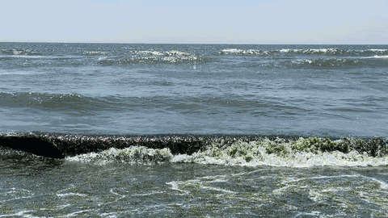

#Video (.mov or .mp4) to GIF

Sample Usage:
`python3 mov_to_gif.py IMG_7709.MOV shore.gif --scale 0.25 --fps 8`

Needs ffmpeg installed on your machine

Use case:
- Make an animated gif to put in your GitHub ReadMe
- Anywhere else where you want a gif

Thanks,
Nick

